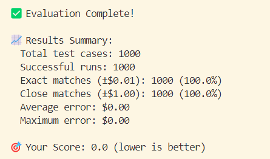

# Top Coder Challenge: Black Box Legacy Reimbursement System

**Reverse-engineer a 60-year-old travel reimbursement system using only historical data and employee interviews.**

ACME Corp's legacy reimbursement system has been running for 60 years. No one knows how it works, but it's still used daily.

8090 has built them a new system, but ACME Corp is confused by the differences in results. Your mission is to figure out the original business logic so we can explain why ours is different and better.

Your job: create a perfect replica of the legacy system by reverse-engineering its behavior from 1,000 historical input/output examples and employee interviews.

## What You Have

### Input Parameters

The system takes three inputs:

- `trip_duration_days` - Number of days spent traveling (integer)
- `miles_traveled` - Total miles traveled (integer)
- `total_receipts_amount` - Total dollar amount of receipts (float)

## Documentation

- A PRD (Product Requirements Document)
- Employee interviews with system hints

### Output

- Single numeric reimbursement amount (float, rounded to 2 decimal places)

### Historical Data

- `public_cases.json` - 1,000 historical input/output examples

## Getting Started

1. **Analyze the data**: 
   - Look at `public_cases.json` to understand patterns
   - Look at `PRD.md` to understand the business problem
   - Look at `INTERVIEWS.md` to understand the business logic
2. **Create your implementation**:
   - Copy `run.sh.template` to `run.sh`
   - Implement your calculation logic
   - Make sure it outputs just the reimbursement amount
3. **Test your solution**: 
   - Run `./eval.sh` to see how you're doing
   - Use the feedback to improve your algorithm
4. **Submit**:
   - Run `./generate_results.sh` to get your final results.
   - Add `arjun-krishna1` to your repo.
   - Complete [the submission form](https://forms.gle/sKFBV2sFo2ADMcRt8).

## Implementation Requirements

Your `run.sh` script must:

- Take exactly 3 parameters: `trip_duration_days`, `miles_traveled`, `total_receipts_amount`
- Output a single number (the reimbursement amount)
- Run in under 5 seconds per test case
- Work without external dependencies (no network calls, databases, etc.)

Example:

```bash
./run.sh 5 250 150.75
# Should output something like: 487.25
```

## Evaluation

Run `./eval.sh` to test your solution against all 1,000 cases. The script will show:

- **Exact matches**: Cases within ±$0.01 of the expected output
- **Close matches**: Cases within ±$1.00 of the expected output
- **Average error**: Mean absolute difference from expected outputs
- **Score**: Lower is better (combines accuracy and precision)

Your submission will be tested against `private_cases.json` which does not include the outputs.

## Submission

When you're ready to submit:

1. Push your solution to a GitHub repository
2. Add `arjun-krishna1` to your repository
3. Submit via the [submission form](https://forms.gle/sKFBV2sFo2ADMcRt8).
4. When you submit the form you will submit your `private_results.txt` which will be used for your final score.

---

**Good luck and Bon Voyage!**

---

# My solution

On the public set:
